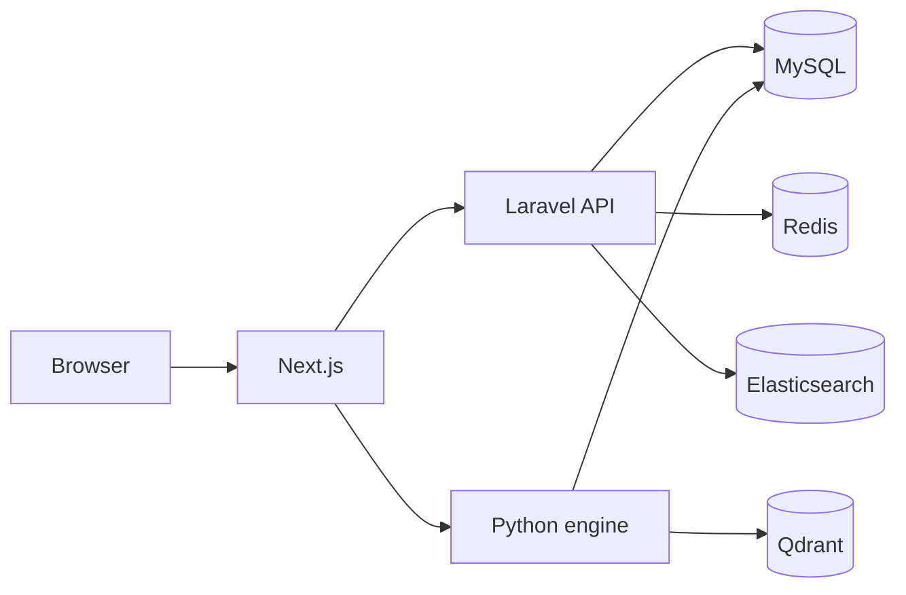

# Decision System Advisor

Web-based investment advisory system: **Next.js** client, **Laravel** REST API, **Python** analysis engine. Primary persistence is **MySQL**; **Elasticsearch**, **Qdrant**, and **Redis** support search, vectors, and caching.

This README is a **committee index**: key figures, short explanations, and how to run locally. Full prose and editable sources live under [`docs/`](docs/).

---

## Quick start (committee)

```bash
# 1. Infrastructure
docker compose up -d

# 2. Backend
cp backend/.env.example backend/.env
cd backend && composer install && php artisan key:generate && php artisan migrate

# 3. Frontend
cp frontend/.env.example frontend/.env.local
cd frontend && npm install && npm run dev
```

| Service | URL |
|---------|-----|
| Web app | http://localhost:3000 |
| Laravel API | http://localhost:1111/api |
| Python engine | http://localhost:8000 |
| MySQL (host) | `127.0.0.1:3307` (user `root`, db `dsa`) |

Environment templates: [`backend/.env.example`](backend/.env.example), [`frontend/.env.example`](frontend/.env.example).

---

## Figures (thesis)

### System architecture

Layered view: browser → Next.js → Laravel → Python, and shared stores (MySQL, Redis, Elasticsearch).  
Detail: [`docs/architecture-diagrams.md`](docs/architecture-diagrams.md)



---

### Database — Chen ERD (Figure 3.2, conceptual)

Entities (rectangles), attributes (ovals), relationships (hexagons). Not a physical table diagram.  
Detail: [`docs/erd-overview.md`](docs/erd-overview.md)


| Domain | Diagram |
|--------|---------|
| Identity & access |  |
| Trading & tickets |  |
| Admin & mail |  |
| Knowledge & crawler |  |
| Instruments & OHLC |  |

---

### Database — physical schema (Figure 3.3, tables)

Columns, PK/FK, types — source of truth: `backend/database/migrations`.  
Detail: [`docs/database-schema-diagrams.md`](docs/database-schema-diagrams.md)


---

### Use cases

End-user and admin boundaries (PlantUML).  
Detail: [`docs/use-case-diagrams.md`](docs/use-case-diagrams.md) · sources: `docs/plantuml/use-case-*.puml`

---

### Class diagrams

Laravel, Python, and frontend layers (Mermaid).  
Detail: [`docs/class-diagrams.md`](docs/class-diagrams.md)

---

### Sequence diagrams

Ranking and trading request flows (Mermaid).  
Detail: [`docs/sequence-diagrams.md`](docs/sequence-diagrams.md)

---

## Repository layout

| Path | Role |
|------|------|
| [`frontend/`](frontend/) | Next.js UI, charts, admin |
| [`backend/`](backend/) | Laravel API, migrations, plugins |
| [`backend/python_engine/`](backend/python_engine/) | FastAPI, ingest, indicators, ranking |
| [`docs/`](docs/) | Thesis diagrams (PlantUML, Mermaid, SVG) |
| [`docker-compose.yml`](docker-compose.yml) | MySQL, Elasticsearch, Qdrant, API, engine |

---

## Reproducing figures

**PlantUML** (Chen ERD, use cases, physical schema):

```bash
export PATH="/opt/homebrew/bin:$PATH"
export PLANTUML_LIMIT_SIZE=16384
java -jar plantuml.jar -tsvg docs/plantuml/chen-*.puml
java -jar plantuml.jar -tsvg docs/plantuml/database-schema-*.puml
```

**Mermaid** (architecture, class, sequence): paste from `docs/*.md` into [mermaid.live](https://mermaid.live), or use `@mermaid-js/mermaid-cli`.

---

## MongoDB: would changing the URL be enough?

**No.** Swapping `DB_HOST` / connection URL to MongoDB is not sufficient, and a thin MySQL ↔ MongoDB “converter” module is not enough on its own.

DSA is built as a **relational** stack end to end:

| Layer | How data is accessed today |
|-------|----------------------------|
| **Laravel** | Eloquent models, migrations, SQL joins, `DB::` queries, repositories |
| **Python engine** | `pymysql` + raw `SELECT` / `INSERT` / `UPDATE` across ingest, OHLC, news, ranking |
| **Schema** | Normalized tables (`instrument_data`, `tickets`, `knowledge_docs`, …) with indexes and FK-style design |

MongoDB is **document-oriented**. There is no drop-in URL change:

1. **Models / access code must change** — Eloquent does not speak MongoDB; you would use `mongodb/laravel-mongodb` (or similar) and rewrite models, relationships, and many queries. Python would move from `pymysql` to `pymongo` (or an ODM) with different query patterns.
2. **Schema must be redesigned** — e.g. embed OHLC arrays per symbol vs separate period rows; denormalize news/chunks; rethink transactions and uniqueness.
3. **Migrations don’t port** — Laravel migrations are MySQL DDL; MongoDB uses collections and indexes, not the same migration files.
4. **A converter alone only helps migration or sync** — useful for one-time ETL or dual-write, but every read/write path still needs a **repository or driver** that targets the store you actually use at runtime.

**Practical options:**

- **Keep MySQL** as system of record (current design; matches thesis ERD).
- **Add MongoDB for a subset** (e.g. raw news blobs, logs) via explicit services — not a global URL swap.
- **Full migration** — new document schema + replace Laravel/Python data layers + data migration scripts; budget a large refactor, not a config change.

---

## Figure sources

```
docs/
├── erd-overview.md              # Chen ERD (Fig. 3.2)
├── database-schema-diagrams.md  # Physical tables (Fig. 3.3)
├── architecture-diagrams.md
├── use-case-diagrams.md
├── class-diagrams.md
├── sequence-diagrams.md
├── plantuml/                    # .puml
├── mermaid/                     # .mmd
└── svg/                         # Rendered SVG for Word/PDF
```
