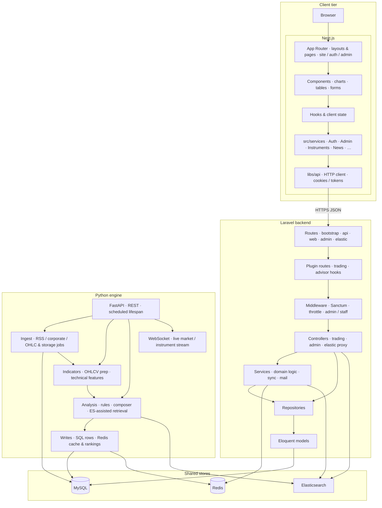
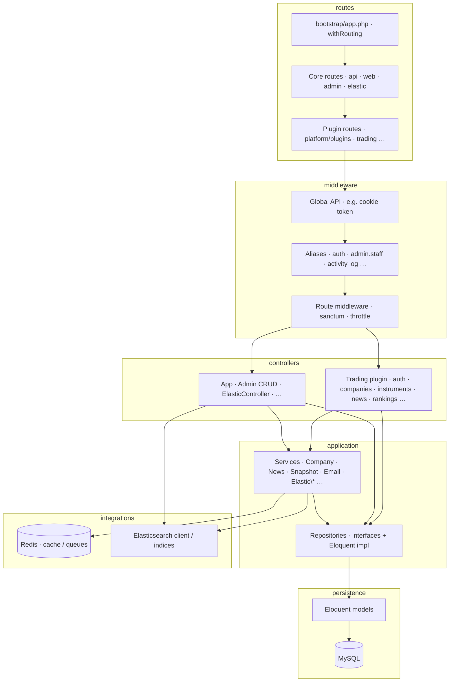
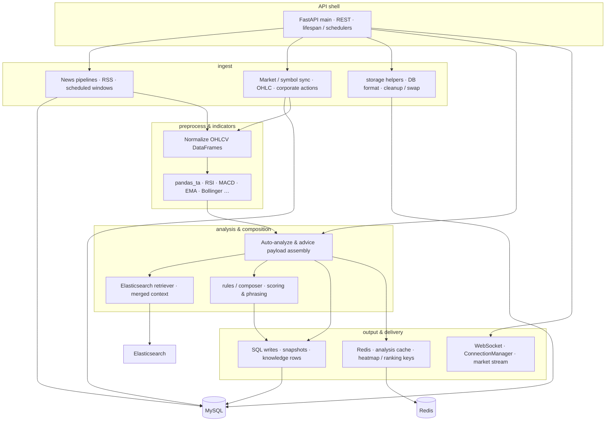
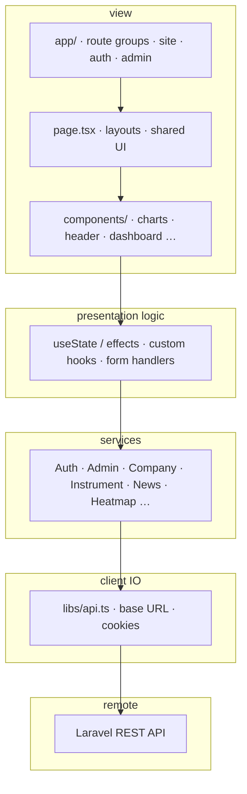

# DSA architecture diagrams (simple layered view)

Mermaid sources for thesis figures. **Chatbot / assistant** paths are omitted; they may still exist in code.

Render in VS Code (Mermaid preview) or [mermaid.live](https://mermaid.live).

**Below:** one **system overview**, then per-tier breakdowns (Laravel, Python, frontend).

---

## System overview

Placement of **Next.js**, **Laravel**, and the **Python** engine, and how each talks to **MySQL**, **Redis**, and **Elasticsearch**. Laravel and Python coordinate mainly through **shared stores** and aligned indices, not only through direct HTTP. Vector search (where used) is treated as an implementation detail of the Python analysis path and is **not** shown as its own store here.



---

## 1. PHP backend (Laravel)



---

## 2. Python engine



---

## 3. Frontend (Next.js)



*(Classic MVC shape: **view** + **logic** acts like UI + controller; **services** encapsulate API calls.)*

---

## Export

Paste each ` ```mermaid ` block (overview first, then §1–§3) into [mermaid.live](https://mermaid.live) and export PNG/SVG.

**UML class diagrams (corrected layers, policies, React mapping):** see [`class-diagrams.md`](./class-diagrams.md).

**Sequence diagrams** (ranking + trading): see [`sequence-diagrams.md`](./sequence-diagrams.md).

**Use cases** (user vs admin, PlantUML): see [`use-case-diagrams.md`](./use-case-diagrams.md) and [`plantuml/use-case-user.puml`](./plantuml/use-case-user.puml), [`plantuml/use-case-admin.puml`](./plantuml/use-case-admin.puml).

**Database ERD** (two PlantUML figures from migrations): [`database-erd.md`](./database-erd.md), [`plantuml/erd-user-domain.puml`](./plantuml/erd-user-domain.puml), [`plantuml/erd-instruments-domain.puml`](./plantuml/erd-instruments-domain.puml).
