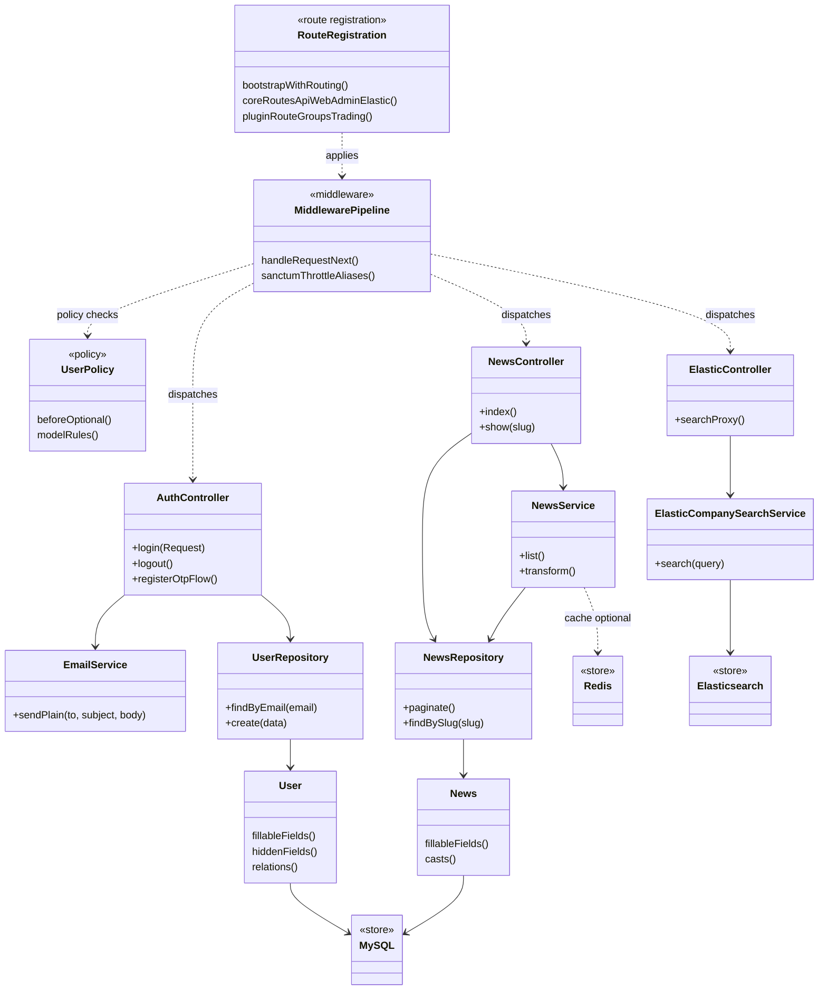
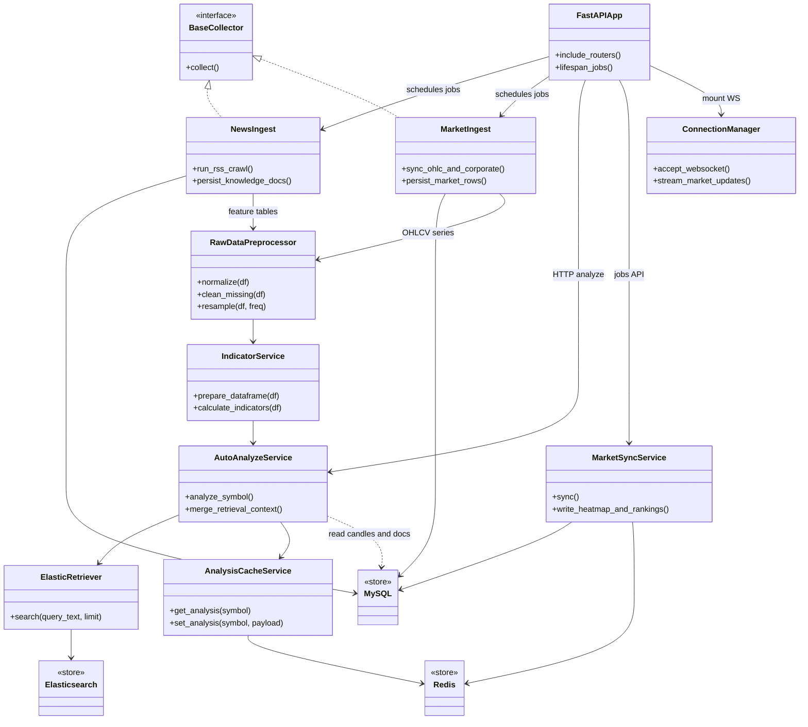
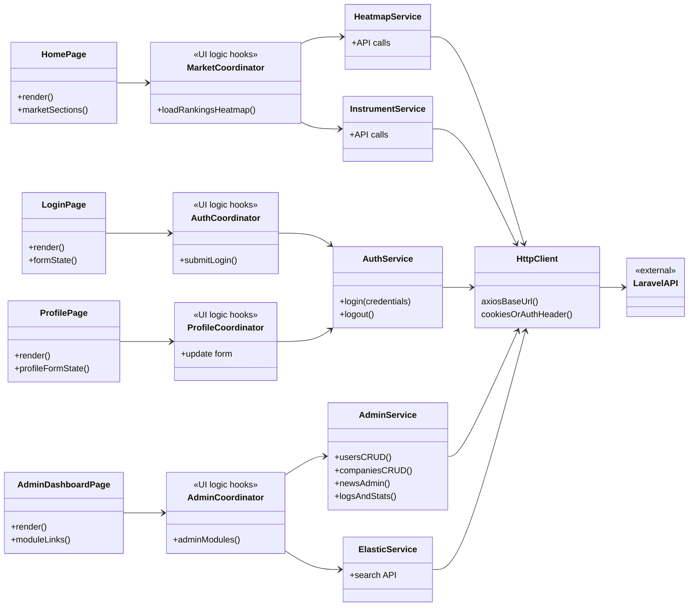

# Class diagrams (revised for thesis)

UML-style **Mermaid `classDiagram`** sources that **fix** the earlier sketches:

| Topic | What changed |
|--------|----------------|
| **Laravel** | Route **bootstrap + route files + plugins** (not only `RouteServiceProvider::boot/map`). **Policies** are per-model Laravel classes with `before()` where used—no generic `PolicyInterface` with `after()`. **Auth** flow matches this repo: controller uses **repository + mail**, not necessarily a custom `AuthService` class. **Elasticsearch** appears explicitly. |
| **Python** | Aligns with **modules** actually present; **no chatbot NLP class** on the diagram. **No Redis pub/sub** requirement; **WebSocket** is in-process. Ingest is mostly **functions / scripts**, not a shared ABC—`BaseCollector` is optional and shown only as a **conceptual** pattern. Method names in the diagram use **snake_case** to match Python style. |
| **Frontend** | **Next.js / React** does not use separate MVC controller **classes**; the middle column is **UI coordinators** (hooks/handlers in real code). **No chat page** on this thesis figure. **Admin** depends on **`AdminService`**, not only knowledge search. |

Render in [mermaid.live](https://mermaid.live) or a Mermaid-capable editor.

---

## 1. Laravel backend (layered)



---

## 2. Python engine (pipelines & services)

**Flow (what to read from the arrows):** ingest jobs **write** to **MySQL** and feed **tabular pipelines** (`RawDataPreprocessor` → `IndicatorService`). **Analysis** is triggered from **FastAPI** (`AutoAnalyzeService`): it **reads** OHLC-style data from **MySQL**, calls **`ElasticRetriever`** for text search hits, writes **Redis** via **`AnalysisCacheService`**, and does **not** receive RSS rows directly from **`NewsIngest`** (no ingest → Elasticsearch shortcut).



\*`BaseCollector` is **not** a real shared ABC in the repo; ingest is implemented as **modules** (`news_crawler`, `stock_sync`, …). The interface is only for **thesis clarity**.

---

## 3. Frontend (Next.js — logical MVC mapping)



**Note:** `*Coordinator` stands for **effects and handlers** that in the real project live **inside** `page.tsx` / components (e.g. `useState`, `useEffect`, `onSubmit`), not separate `.ts` classes.

---

## Export

Copy each ` ```mermaid ` block into [mermaid.live](https://mermaid.live) for PNG/SVG.
