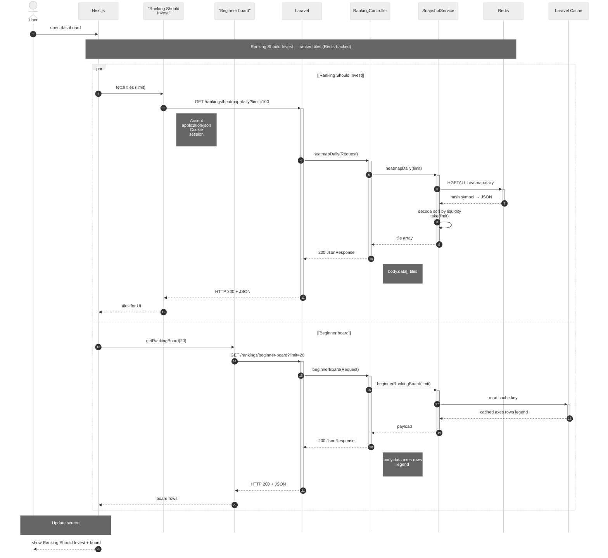
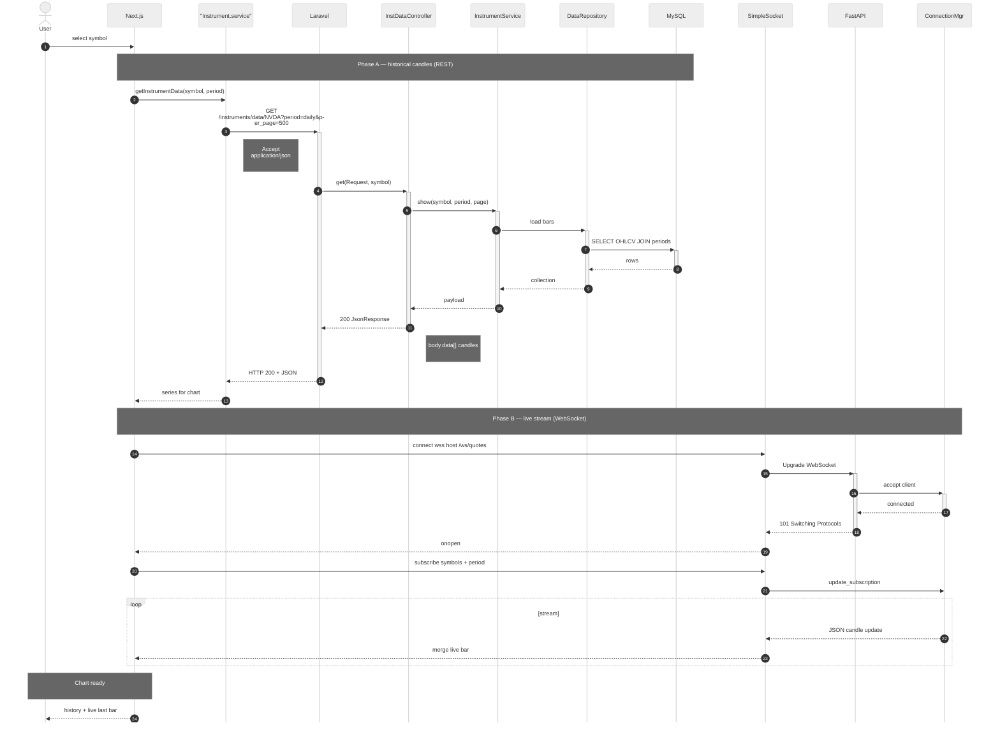

# Sequence diagrams (Mermaid)

Two **end-to-end** figures: **ranking** and **trading**. Only the **primary success path** (no SQL fallback, no cache-miss branch, no error responses).

Render: [mermaid.live](https://mermaid.live) → export **SVG** or PNG for Word.

---

## 1. Ranking Should Invest & beginner leaderboard

**Ranking Should Invest** is the product name for the ranked tile view (backend route `heatmap-daily`, Redis key `heatmap:daily`). The **beginner board** uses a **Laravel cache** hit. **Request → response** on each hop.

Diagram uses **large type** (~**32–34 px** messages / actors in Mermaid) plus extra vertical spacing so Word exports stay readable.

### Description (Figure 1 — ranking)

When the user opens the dashboard, **Next.js** starts **two independent calls in parallel** so the page can paint both ranking widgets without waiting for one to finish before the other.

**Ranking Should Invest (ranked tiles).** The front-end module asks the back end for a page of tiles via **`GET /rankings/heatmap-daily`** with a **limit** query parameter and standard **JSON** acceptance and **session** cookies. **Laravel** hands the request to **`RankingController::heatmapDaily`**, which delegates to **`SnapshotService::heatmapDaily`**. The service reads the denormalized daily map from **Redis** with **`HGETALL heatmap:daily`**, decodes each field, **sorts by liquidity**, truncates to the limit, and returns a **tile array**. The controller wraps that in an **HTTP 200** response whose **`data`** array holds the tiles. The same path is mirrored as a clear **request–response** chain: browser → Next.js → Laravel → controller → service → Redis, then responses propagate back until Next.js receives **tiles for the UI**.

**Beginner board.** In parallel, Next.js calls **`getRankingBoard`** which issues **`GET /rankings/beginner-board`** with a **limit**. The same **`RankingController`** invokes **`SnapshotService::beginnerRankingBoard`**, which resolves a **cache key** on **Laravel’s cache** store and, on a hit, receives the precomputed **axes**, **rows**, and **legend**. The controller again returns **HTTP 200** with a **`data`** object describing the board. The responses return to Next.js as **board rows** for rendering.

After both branches complete, Next.js **updates the screen** and the user sees **Ranking Should Invest** and the **beginner board** together. (Implementation note: the public name *Ranking Should Invest* corresponds to the **`heatmap-daily`** route and **`heatmap:daily`** Redis key in code.)

---

## 2. Trading (historical OHLCV + live WebSocket)

**REST** loads candles from **Laravel**; **WebSocket** attaches to **Python FastAPI** for streaming updates. Same **font sizes** and spacing as diagram 1.

### Description (Figure 2 — trading)

The **trading** view is built in **two phases**: first the **historical series** is loaded over **REST** from **Laravel**; then a **live** channel over **WebSocket** to **Python FastAPI** keeps the last bar (or quotes) fresh.

**Phase A — historical candles (REST).** After the user **selects a symbol**, Next.js calls **`Instrument.service`** to **`getInstrumentData`** for that symbol and **period** (for example **daily**). The service sends **`GET /instruments/data/{symbol}`** with **`period`**, **`per_page`**, and **`Accept: application/json`**. **Laravel** routes to **`InstrumentDataController::get`**, which calls **`InstrumentService::show`**. The service uses **`InstrumentDataRepository`** to run **SQL** joining **instrument data** with **periods**, loads **OHLCV** rows from **MySQL**, and assembles a **payload**. The controller returns **HTTP 200** with **`data`** as an array of **candles**. The **response** travels back through Laravel to the front-end service and then to Next.js as a **time series** ready for the chart library. Every hop is paired with a return message so the diagram reads as explicit **request–response** behavior.

**Phase B — live stream (WebSocket).** Next.js opens a **WebSocket** (for example **`wss://…/ws/quotes`**) through a **SimpleSocket** helper. The client sends an **Upgrade** request; **FastAPI** accepts the socket via **`ConnectionManager`**, and the server answers **101 Switching Protocols**. On **open**, the UI sends a **subscribe** message (symbols and **period**). The connection manager records **subscriptions** and, in a **loop**, pushes **JSON** messages with **candle** (or tick) updates. The client **merges** each update into the chart state so the **last bar** moves without reloading the full history.

**Outcome.** The user sees **history from MySQL via Laravel** plus a **continuously updated last segment** from the **Python** streaming layer, with both phases documented as sequential **request–response** (REST) and **event-driven** (WebSocket) interactions.

---

## Thesis-ready paragraph (copy-paste)

Use the text below in the main chapter (e.g. system design or dynamic behaviour). It matches the two sequence diagrams; adjust figure numbers to your document.

The ranking dashboard combines two concurrent client–server interactions. When the user opens the page, the Next.js client issues two parallel HTTP requests. The first request retrieves ranked market tiles for the “Ranking Should Invest” view by calling the REST endpoint for daily heatmap data with a configurable limit. Laravel dispatches this call to the ranking controller and snapshot service, which read a denormalised hash from Redis, decode and sort the entries by liquidity, and return an HTTP 200 response whose payload lists the tiles. The second request loads the beginner leaderboard through a separate REST endpoint handled by the same controller layer; the snapshot service resolves a cache key in Laravel’s cache store and, on a hit, returns a JSON structure containing axis definitions, ranked rows, and a legend. Both responses are merged on the client so the user sees the tile grid and the board in one layout. In the implementation, the public label “Ranking Should Invest” corresponds to the heatmap-daily API route and the Redis key used for pre-aggregated daily tiles.

The trading workflow proceeds in two stages so that historical context and live updates are clearly separated. First, the client requests historical OHLCV candles through a stateless GET request to the Laravel API, specifying symbol, period, and pagination parameters. The request is handled by the instrument data controller, which delegates to a domain service and repository that query MySQL for candle rows joined to instrument periods; the server responds with HTTP 200 and a JSON array of candles, which the front end maps into a time series for the chart. Second, the client opens a WebSocket connection to the Python FastAPI service, completes the protocol upgrade, subscribes to the chosen symbols and period, and then receives asynchronous JSON messages that carry incremental candle or quote updates. The interface merges these messages into the existing series so the most recent bar evolves without reloading the full history. Together, the synchronous REST phase and the event-driven WebSocket phase implement a hybrid pattern typical of market dashboards: authoritative history from the relational database and low-latency updates from the streaming engine.

---

## Word export

Copy **each** diagram block into [mermaid.live](https://mermaid.live) and export SVG or PNG. The `%%{init: ...}%%` block sets **larger type** and **more vertical spacing**; in Word, set image width to full text width—the diagram should read **taller** than a default Mermaid export, not only stretched wide.
