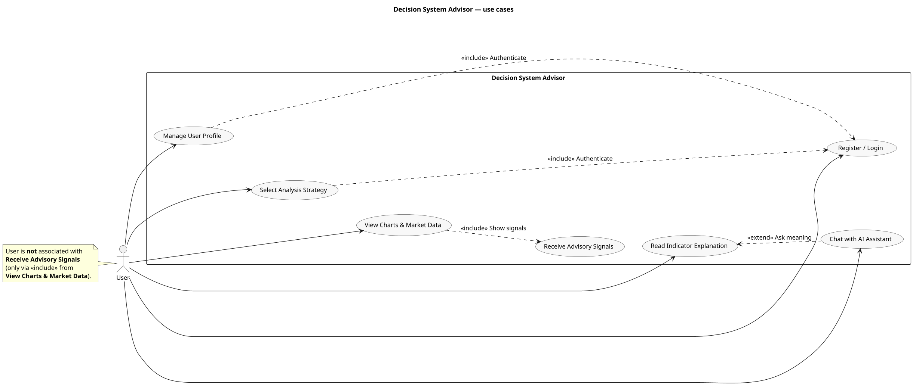
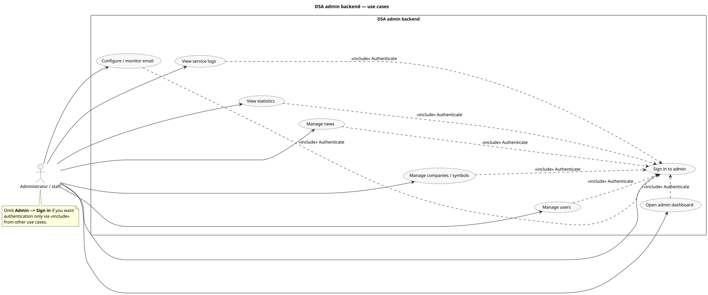
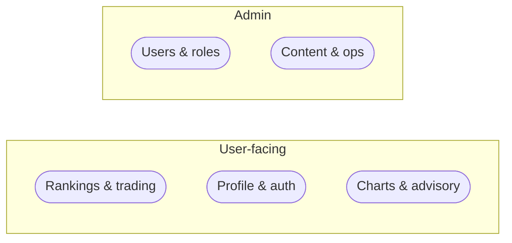

# Use case diagrams (PlantUML)

UML **use case** diagrams: **stick-figure** `actor`, **rectangle** system boundary, **usecase** ovals, **association** (`-->`), **«include»** (`.>` dashed), **«extend»** (`<..` dotted).

**Layout (labels inside the boundary).** Graphviz often routes «include»/«extend» along the **left** edge of the use-case cluster, so stereotype text overlaps **actor** associations. These diagrams add a transparent **`agent`** (`COL_GAP`) as a **vertical corridor** between the main stack of use cases and **Register / Login** / **Sign in to admin**. Hidden links (`-[hidden]right-`) pull that column to the **right** so dashed dependency labels sit **inside** the system rectangle, **to the right** of the primary ovals. Tune `skinparam nodesep` / `ranksep` if the figure is too wide for your PDF.

**Source files** (edit and render from disk):

- [`plantuml/use-case-user.puml`](./plantuml/use-case-user.puml) — Decision System Advisor (end user)
- [`plantuml/use-case-admin.puml`](./plantuml/use-case-admin.puml) — DSA admin backend

**Render**

1. [PlantUML Web Server](https://www.plantuml.com/plantuml/uml/) — paste file contents or encode URL.
2. **VS Code / Cursor:** [PlantUML extension](https://marketplace.visualstudio.com/items?itemName=jebbs.plantuml) + Graphviz (or built-in server).
3. **CLI:** `java -jar plantuml.jar docs/plantuml/use-case-user.puml` → PNG/SVG in the same folder.

---

## 1. User — Decision System Advisor

**User** is **not** directly associated with **Receive Advisory Signals** (only via **«include»** from **View Charts & Market Data**).

**Relationship summary**

| Type | From | To | Label |
|------|------|-----|--------|
| association | User | Register / Login, Manage Profile, Select Strategy, View Charts, Read Indicator, Chat with AI | — |
| «include» | Manage User Profile | Register / Login | Authenticate |
| «include» | Select Analysis Strategy | Register / Login | Authenticate |
| «include» | View Charts & Market Data | Receive Advisory Signals | Show signals |
| «extend» | Chat with AI Assistant | Read Indicator Explanation | Ask meaning |

PlantUML: `UC_IND <.. UC_CHAT : <<extend>>` — arrow from extension to base (**Chat** extends **Read Indicator**).

---

## 2. Administrator / staff — DSA admin backend

Each operational use case **«include»**s **Sign in to admin** for authentication.

---

## 3. Compact overview (Mermaid, no UML actor)

Optional high-level map without actors (not PlantUML use-case notation).

---

## Export for thesis

1. Open [`use-case-user.puml`](./plantuml/use-case-user.puml) and [`use-case-admin.puml`](./plantuml/use-case-admin.puml) in a PlantUML-capable tool.  
2. Export **SVG** or **PNG** (vector SVG scales better in PDF).  
3. Caption may use **«include»** / **«extend»** (Unicode guillemets) to match UML.

---

## See also

[`architecture-diagrams.md`](./architecture-diagrams.md) · [`sequence-diagrams.md`](./sequence-diagrams.md)
